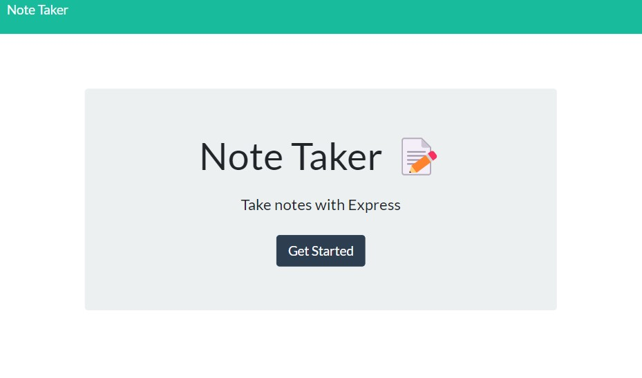

# Note Taker

## Description

---

A tool to write and access notes, to help keep ones self organized.  
[Link to deployed page.](https://polar-lake-05052.herokuapp.com/)

---

## <ins>Table of Contents</ins>

- [Installation](#installation)
- [Usage](#usage)
- [License](#license)
- [Contributing](#contributing)
- [Tests](#tests)
- [Contact](#questions)

---

## Installation

NodeJs Express Library

## Usage

To take and view notes

## License

This project is licensed under

## Contributing

Kmac5000

---

## Questions:

Rivermac5000@gmail.com

https://github.com/Kmac5000
